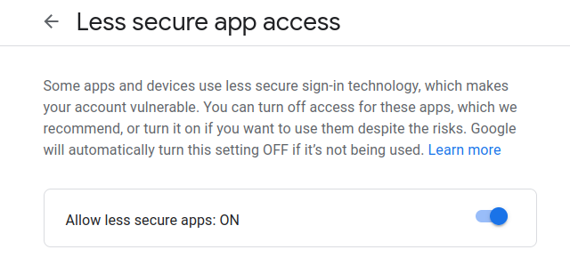
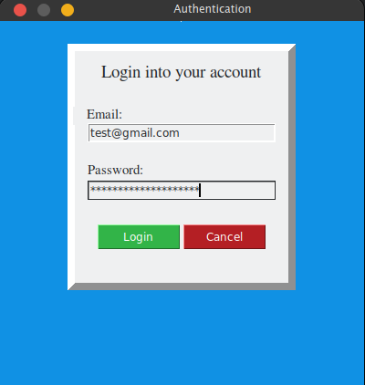

# Niabeep
Niabeep is a UI program designed for sending google emails, using googles SMTP servers. It was coded using python's built in tkinter and smtplib library. Note: In order to use this UI program the user must enable Less secure app access in there [google account security settings.](https://myaccount.google.com/lesssecureapps)  

## Installation 
1. Clone repo
```
git clone https://github.com/KenjiDoom/niabeep.git
```
2. Install Tkinter (arch linux) 
```
pacman -S tk
```
3. Run program
```
python niabeep.py
```
 

